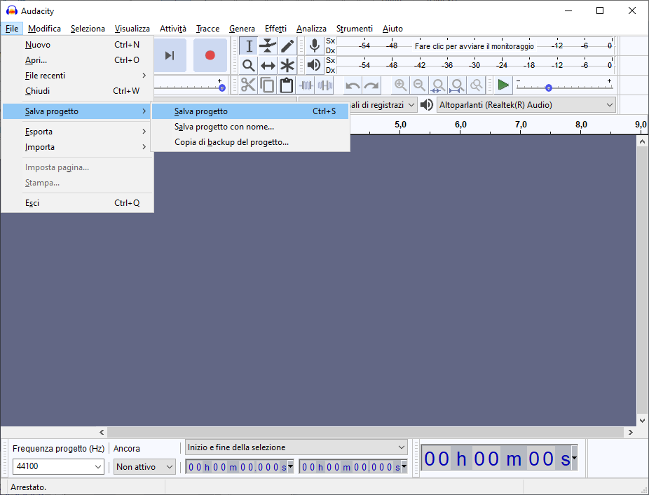

# audacity-loopback
A quick description to "How to register Loopback Audio on Audacity"

### Questa breve guida si basa su sistema operativo Windows 10.
Scaricare il programma Audacity dal sito ufficiale, [link al download](https://www.audacityteam.org/download/).

Installare il programma (immagini 1 to 8).

*Privacy? Quale privacy? =D*

All'avvio selezionare "Non mostrare più all'avvio"

Selezionare dal menù a tendina *Windows WASAPI* [RTFM](https://docs.microsoft.com/en-us/windows/win32/coreaudio/wasapi)

Selezionare dal menù a tendina *Altoparlanti (Realtek(R) Audio) (loopback)* 
* NB, potrebbe non chiamarsì così. Selezionate comunque la voce che contiene *loopback*

Dopodiché creare un progetto di registrazione:

*File > Salva Progetto > Salva Progetto*

Disabilitare il Warning.

Salvare inserendo nome e lasciando estensione progetto invariata.

Ora, senza giudicare, io uso una canzone *(la canzone)*, voi registrate le lezioni.

Premendo il bottone rosso e facendo partire la canzone le casse verranno registrate.

* NB, potrete parlare, cantare, videochiamare dal cellulare, nessun microfono verrà registrato.
Non guardate video dal pc o rimuovete WhatsApp web in quanto _TUTTI_ i media verranno registrati.

Una volta finito, potete salvare con *Ctrl + S*.

Esportate in .mp3

Audacity crea alcuni file progetto di X GB, potete eliminarli una volta finito di esportare il file in .mp3.

# The End

## Glossario
+ *Loopback*  = "Interfaccia di loopback, *torna indietro*"
+ *RTFM*  = "Read the fucking manual"
